As well as running the TM351 VM on your own computer, the virtual machine can also be hosted on a remote server.

Amazon AMIs are virtual machine images that can be used to launch pre-configured virtual machines using Amazon Web Services (AWS).

The TM351 VM has been packaged as an AMI in one AWS region. If you have an Amazon webservices account, you can use this AMI to run the TM351 VM.

**You are personally responsible for any charges incurred from Amazon or other cloud service providers when using the TM351 VM on AWS.**

To use the TM351 VM AMI instance and then work through the following sections: 

- [create an Amazon AWS user account](https://aws-portal.amazon.com/gp/aws/developer/registration/index.html)

#### Choose AMI

The TM351 is currently only available in the *eu-west-1 (Ireland)* region.

Start the AWS AMI launch wizard: [ami-ab1403cd - eu-west (Ireland)](https://console.aws.amazon.com/ec2/home?region=eu-west-1#launchAmi=ami-ab1403cd).

#### Choose Instance Type

It is recommended that you use a `t2.small` server or above.

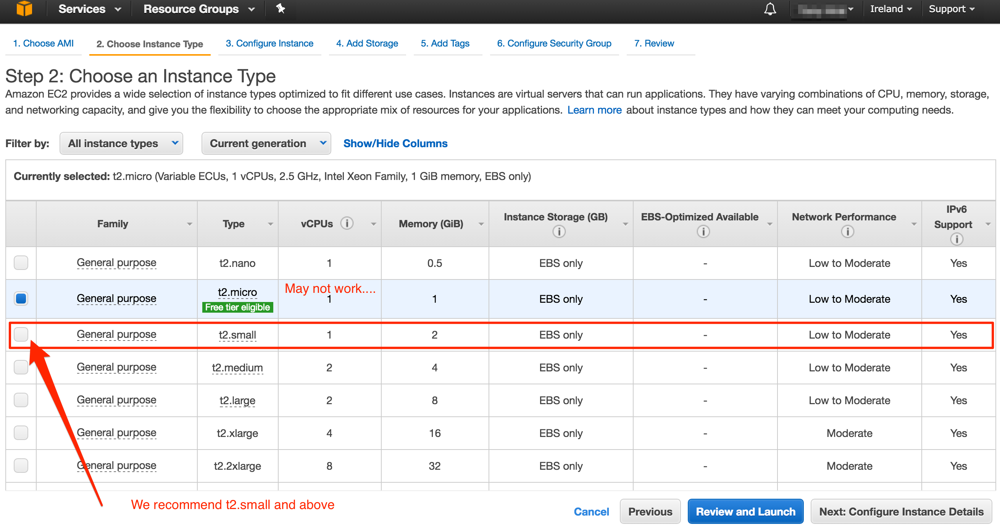

**Note - if you use the `t2.micro` server, which is available on the AWS free tier, only 1GB of RAM is available. The OpenRefine service and the sharded mongo database may not run under this resource constraint. All services should run correctly using the 2GB `t2.small` machine, and up.**

#### Configure Instance

You can accept the default settings in this step. 

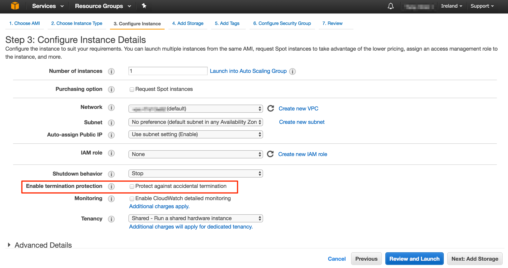

If you want to make sure you don't accidentally delete the storage volume associated with the instance that contains your notebooks and OpenRefine project files, check the *Protect against accidential termination* option.

Move on to the next step.

#### Add Storage

The storage volume contains all the files associated with the machine instance, including your Jupyter notebooks and Open Refine project files.

You should not need to add any additional storage. 

Bu default, the storage volume (and all your files) will be deleted if the instance it is attached to is terminated. You may wish to uncheck this option (*though I'm not sure atm how you would reattach it to a new instance?*).

When you are happy with he settings, move on to the next step.

#### Add Tags

You can ignore this step. Accept the defaults and move on to the next step.

#### Configure Security Group

There are several ways to configure the security group rules that allow the outside world to access the services running on an instance of the TM351 AMI via incoming traffic rules applied to specified ports.

##### Create a new security group using the AWS Console

Use the AWS AMI Launch Wizard to create a new security group.

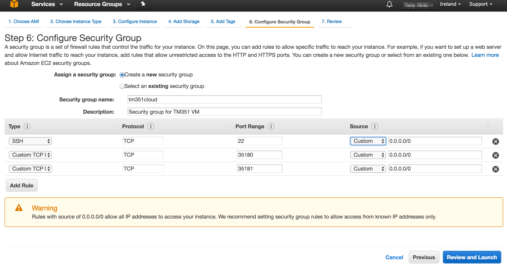

To allow access to the services from any IP address, set the permissions as follows:

| Type | Protocol | Port Range | Service | *Notes* |
|------|---|---|---|---|
| SSH | TCP | 22 | 0.0.0.0/0 | *ssh access* |
| Custom TCP | TCP | 80 | 0.0.0.0/0 | *Web server* |
| Custom TCP | TCP | 35180  | 0.0.0.0/0 | *Jupyter notebook* |
| Custom TCP | TCP | 35181  | 0.0.0.0/0 | *Open Refine* |

You can also limit the range of IP addresses from which the services can be accessed. For example, if your computer has a fixed IP address, you could restrict access to services from just that address.

##### Reuse an appropriately configured previously existing security group
Select the previously existing group; check that the permissions are set as above.

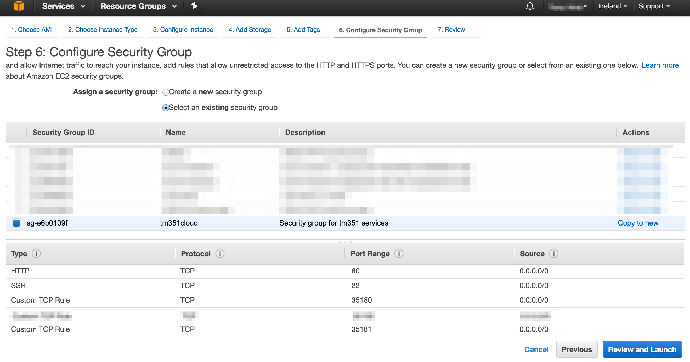

##### Create a security group using the AWS Console
You can create a security group from the AWS Web Console or from the [AWS CLI (command line interface)](https://aws.amazon.com/cli/). (See the section below on *Getting Started with the AWS CLI*.)

- Create security group, (for example, called *tm351cloud*):
  - `aws ec2 create-security-group --group-name tm351cloud --description "Security group for TM351 VM services"`
- Create security group rules:
  - `aws ec2 authorize-security-group-ingress --group-name tm351cloud --protocol tcp --port 22 --cidr 0.0.0.0/0`
  - `aws ec2 authorize-security-group-ingress --group-name tm351cloud --protocol tcp --port 80 --cidr 0.0.0.0/0`
  - `aws ec2 authorize-security-group-ingress --group-name tm351cloud --protocol tcp --port 35180 --cidr 0.0.0.0/0`
  - `aws ec2 authorize-security-group-ingress --group-name tm351cloud --protocol tcp --port 35181 --cidr 0.0.0.0/0`
- Check security group policy:
  -  `aws ec2 describe-security-groups --group-names tm351cloud`

The above settings are permissive and allow access to the ports from any IP address. You can also limit access to a particular port to requests issued from a particular IP address. For example, to limit command line access via SSH to connections from your computer, you could set the policy for the SSH port 22 as follows:

- `MYIP=$(curl http://checkip.amazonaws.com/)`
- `aws ec2 authorize-security-group-ingress --group-name tm351cloud --protocol tcp --port 22 --cidr ${MYIP}/0`

#### Review Instance Launch

The final step before launching the instance is to review the settings.

If you do not want to be able to login to the instance using SSH from the command line on your own computer, you can choose to *Proceed without a key pair*.

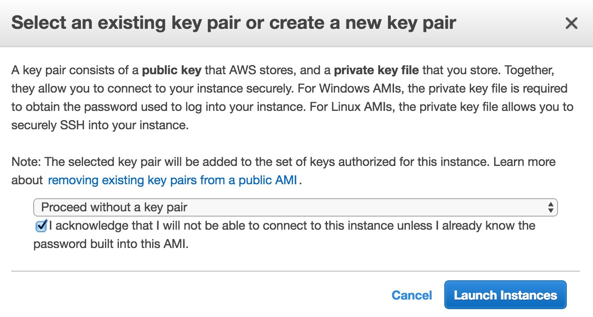

If you think you might want to log in to the machine using SSH from the command line on your own computer, you will need to create and download a cryptographic key pair, reuse a key pair you have already set up on AWS or use your own keys. ([AWS - Using Key Pairs](http://docs.aws.amazon.com/AWSEC2/latest/UserGuide/ec2-key-pairs.html).)

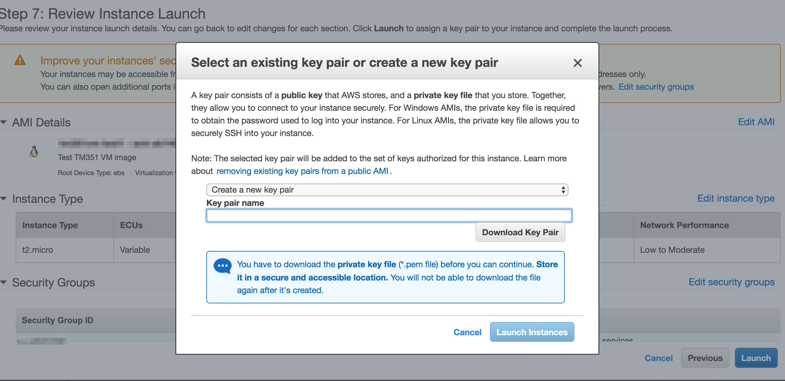

If you created and saved your keypair with the name `vagrantaws`, and saved the keyfile as `vagrantaws.pem` to the current directory, you would then be able to login to the machine from your command line with a command of the form:

`ssh -i vagrantaws.pem ubuntu@ec2-WHATEVER.eu-west-1.compute.amazonaws.com`

#### Using the Instance

To use the instance, go into the *Instances* tab of the AWS Web Console. You should see you machine instance there. You can also give the instance a name:

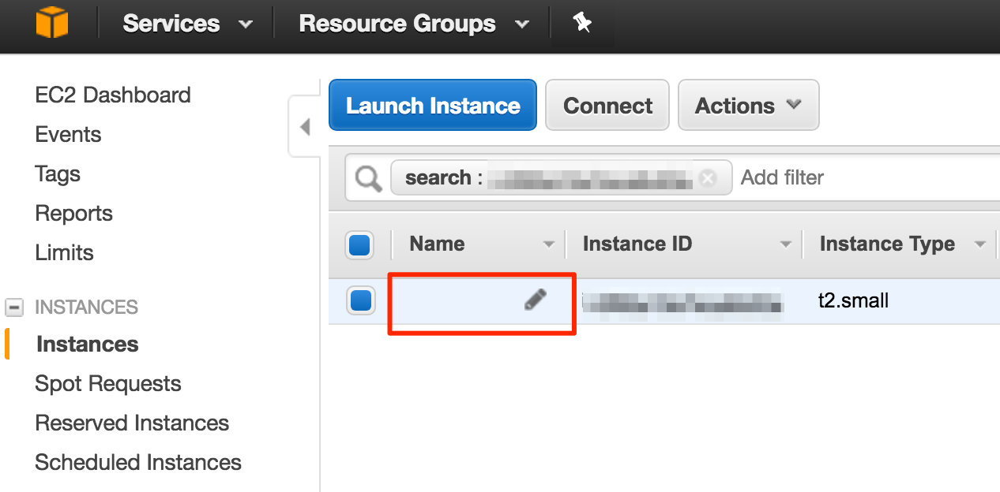

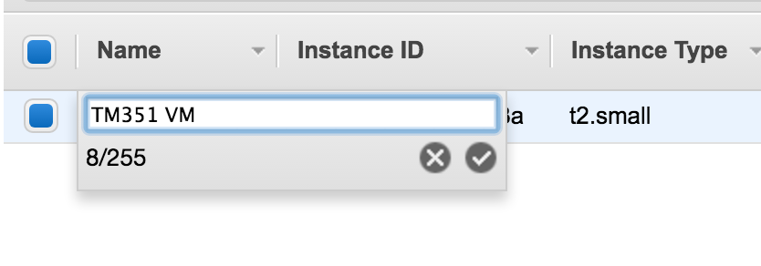

From the console page, find the **public IP address** for the instance.

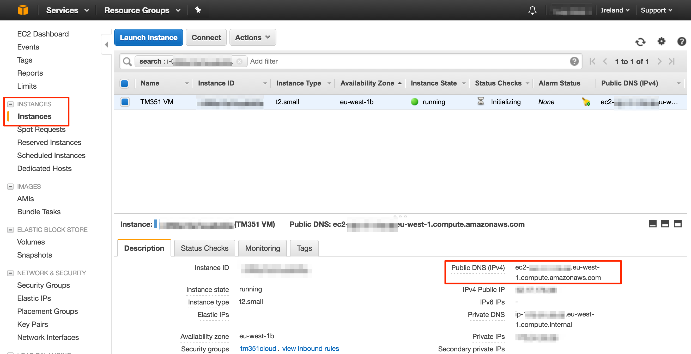

Copy this address into your web browser and you should see the TM351 AMI homepage:

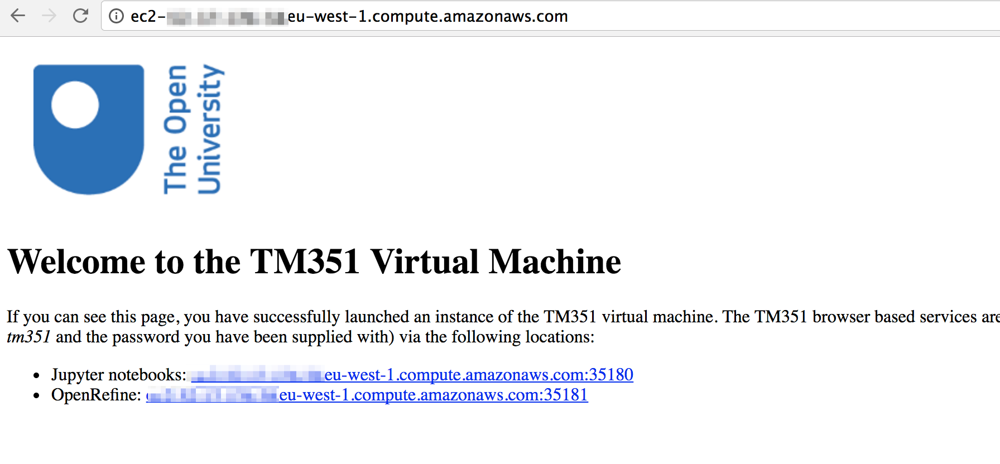

On port **35180** at that URL you should be able to see the Jupyter notebook server. Log in with the password: `tm351`.

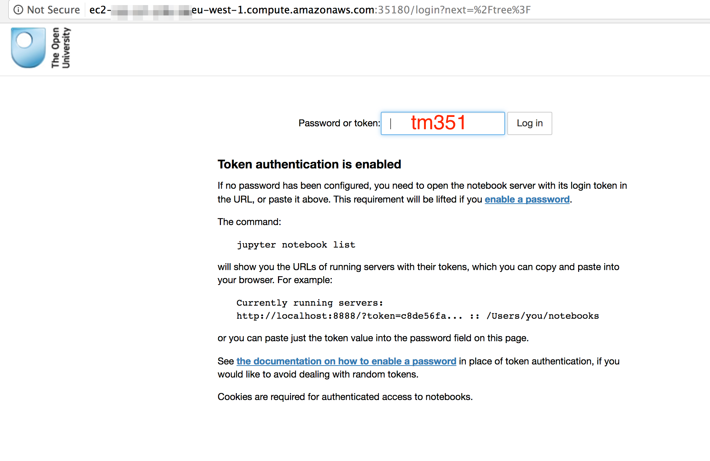

On port **35181** at that URL you should be able to reach the Open Refine server once you have got through an authentication layer. Log in with the username `tm351` and no password.

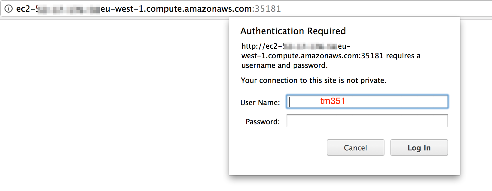

#### Starting and Stopping the Instance

You can start and stop the machine instance from the *Instances* tab of the web console.

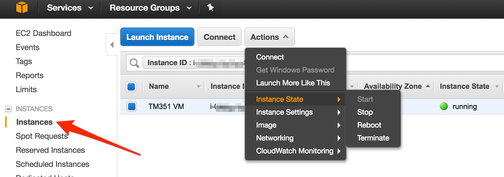

- **Start** will start a previously stopped instance and attach the corresponding storage volume containing your files;
- **Stop** will stop a running instance and preserve the current storage volume;
- **Reboot** will reboot the instance using the current storage volume;
- **Terminate** will destroy the machine instance **and delete your storage volume**. So if you terminate the machine, you will lose any Jupyter notebooks or Open Refine project files you did not otherwise backup or download.

#### Trying Not to Pay Too Much!

The AWS business model works by chargug metered to access (pay for what you use) access to a wide range of web services. When you run a machine instance, you will have a `running instance` and a storage `volume` associated with it. The instance is billed according to the machine size and for each hour or part thereof it runs for ([AWS Instance pricing](https://aws.amazon.com/ec2/pricing/on-demand/)]. The volume is used to store all the VM files, including notebooks and project files you have created or edited; this is billed per gigabyte month of storage ([EBS volume pricing](https://aws.amazon.com/ebs/pricing/)).

You can see what services you are consuming from the [EC2 dashboard](https://eu-west-1.console.aws.amazon.com/ec2/v2/home?region=eu-west-1). Note that AWS services are provisioned on a regional basis  - which means you need to check the dashboard for any region within which you have launched a service. (At the current time, the TM351 AMI is only available in the *eu-west-1 (Ireland)* region.

## Getting Started with the AWS CLI

As well as controlling Amazon Web Services via the online web console, you can also execute commands from the command line using the [AWS CLI (command line interface)](https://aws.amazon.com/cli/).

- [Download and install the Amazon Command Line Interface](http://docs.aws.amazon.com/cli/latest/userguide/installing.html)
- [Configure the command line interface](http://docs.aws.amazon.com/cli/latest/userguide/cli-chap-getting-started.html): `aws configure`. You can find your *root* user credentials here: [AWS Console - security credentials](https://console.aws.amazon.com/iam/home?/security_credential#/home).
- *Optionally* create a user with limited permissions to make use of the AWS CLI:
  - create user: `aws iam create-user --user-name vagrant`
  - attach [approriate policy or policies](http://docs.aws.amazon.com/general/latest/gr/aws-arns-and-namespaces.html) to user: `aws iam attach-user-policy --user-name vagrant --policy-arn arn:aws:iam::aws:policy/AmazonEC2FullAccess`
  - redo `aws configure` using credentials from: `aws iam create-access-key --user-name vagrant`

